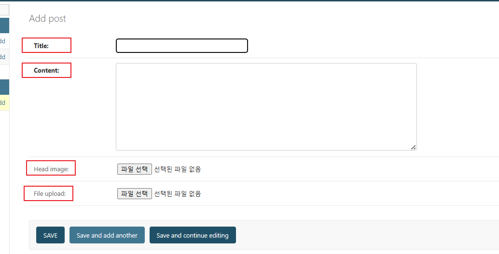

30일 정도 남았을때 이력서를 꼭 주셔야합니다. => 피드백 해드립니다. (기본 틀은 제공해줄 겁니다.)

# 추후 목표
1. 버전 관리(GitHub 중급을 배웠으면 중간 중간 push를 했을 것입니다.)
2. 클래스 기반 뷰(이번 시간 공부)
3. admin 커스터마이징
4. DB 설계(1:1, 1:N, N:M)

# 이번 시간 목표(Class Base View 실습)
1. 버전 확인 및 관리
2. 클래스 기반 뷰
- 취업을 하려면 DRF를 할줄 알아야하고 RESTfullAPI를 경험해봐야한다.


# django
```python

mkdir cbv
cd cbv
python -m venv venv
.\venv\Scripts\activate

pip install django
pip install pillow

django-admin startproject tutorialdjango .
python manage.py migrate

python manage.py startapp blog

################################
# tutorialdjango > settings.py

ALLOWED_HOSTS = ["*"]

INSTALLED_APPS = [
    "django.contrib.admin",
    "django.contrib.auth",
    "django.contrib.contenttypes",
    "django.contrib.sessions",
    "django.contrib.messages",
    "django.contrib.staticfiles",
    "blog",
]

"DIRS": [BASE_DIR / "templates"],

################################

# urls 기획

1. 다음 url이 실제 작동하도록 해주세요.
1.1 'blog/'                     : 블로그 글 목록
1.2 'blog/<int:pk>/'            : 블로그 글 읽기
1.3 'blog/write/'               : 블로그 글 작성
1.4 'blog/edit/<int:pk>/'       : 블로그 글 업데이트
1.5 'blog/delete/<int:pk>/'     : 블로그 글 삭제

###################################
앱이름: blog                views 함수이름    html 파일이름  비고
'blog/'                     blog_list        blog_list.html    
'blog/<int:pk>'             blog_details     blog_details.html
'blog/write/'               blog_write       blog_write.html
'blog/edit/<int:pk>/'       blog_edit        blog_edit.html
'blog/delete/<int:pk>/'     blog_delete      blog_delete.html

################################
# tutorialdjango > urls.py

from django.contrib import admin
from django.urls import path, include

urlpatterns = [
    path('admin/', admin.site.urls),
    path('blog/', include('blog.urls')),
]

################################
# blog > urls.py

from django.urls import path
from . import views

urlpatterns = [
    path("", views.blog_list, name="blog_list"),
    path("<int:pk>/", views.blog_details, name="blog_details"),
    path("write/", views.blog_write, name="blog_write"),
    path("edit/<int:pk>/", views.blog_edit, name="blog_edit"),
    path("delete/<int:pk>/", views.blog_delete, name="blog_delete"),
    path("test/", views.test, name="test"),
]

################################
# blog > views.py

# 장고에서 리스트뷰를 사용하고 싶어? 그럼 ListView를 사용하세요 처럼 애초에 List 출력하는 페이지에 대한 기본 셋팅을 제공해준다.
# 즉 우리가 만들려던 CRUD 페이지 구현을 기본적으로 제공해준다. -> 호출해서 사용만 하면 된다(그전처럼 직접 태그를 작성해서 구현하지 않음)
from django.views.generic import (
    ListView,
    DetailView,
    CreateView,
    UpdateView,
    DeleteView,
)
from .models import Post
from django.urls import reverse_lazy
from django.http import HttpResponse


# 클래스 기반 뷰가 꼭 제네릭 뷰는 아닙니다.
# 클래스로 HttpResponse를 반환하게 하면 그것도 클래스 기반 뷰입니다.
# 실무에서는 클래스 기반 뷰를 제네릭 뷰라고 부르는 경우가 많습니다.
# 제네릭 뷰는 장고에서 제공하는 여러가지 기능을 미리 구현해 놓은 클래스 기반 뷰입니다.


# model = Post : DB 연결(Post가 DB 내용, model에 할당)


class PostList(ListView): # BlogList class는 ListView를 상속 받음
    model = Post # Post 객체를 통해 DB내용을 model과 연결
    ordering = "-pk" # 내림차순 정렬, 기본 값은 최신 게시물이 DB상엔 맨 아래에 저장되므로 역순으로 정렬하고 최신 저장 내용을 가져와 출력
    # template_name = "blog/내가_원하는_파일명.html" # 기본값: blog/post_list.html로 설정되므로 내가 변경하려면 사용하지만 선언안하면 기본값 사용 => 여기에 내가 연결할 템플릿경로를 작성하면된다.(해당 url로 들어오는 것에 대한 html 파일을 연결하는 것)

class PostDetail(DetailView): # import한 DetailView 상속
    model = Post # Post는 DB데이터, DB데이터를 model에 연결하여 실제 출력 페이지에 반영하는 것
    # template_name = "blog/내가_원하는_파일명.html" # 기본값: blog/post_detail.html

class PostCreate(CreateView):
    model = Post # 이런식으로 반드시 DB와 model을 연결해줘야한다.
    fields='__all__' # DB의 모든 컬럼을 가져온다
    # template_name = "blog/내가_원하는_파일명.html" # 기본값: blog/post_form.html
    success_url=reverse_lazy('blog_list')
    # reverse_lazy('blog_list') 하는 이유는 object가 생성되고 나서 url로 이동해야하는데 reverse함수는 함수이기 떄문에 함수가 실행되는 시점에 url로 바로 이동하게 되어버린다.
    # 그래서 post가 생성된 후에 url로 이동하게 하기 위해서 기다리겠다는 함수가 reverse_lazy를 사용한다.
    # 즉 DB가 연결되고 반영되었다는 신호가 오면 해당 url로 이동하겠다는 것(비동기식이기 때문에 DB와 연결되고 반영되었다는 신호와 함수가 별개로 수행되고 DB 연결이 되기전에 함수가 실행되면 url로 이동한다)
    # 따라서 Post의 DB내용과 모델이 연결될 때까지 기다렸다가 정상적으로 연결되었다면 reverse_lazy 함수를 통해 해당 url로 이동하는 것(절대 reverse() 함수 사용x -> 안기다리고 바로url이동함)

class PostUpdate(UpdateView):
    model = Post 
    fields='__all__'
    success_url=reverse_lazy('blog_list')
    # template_name = "blog/내가_원하는_파일명.html" # 기본값: blog/post_form.html


class PostDelete(DeleteView):
    model = Post 
    success_url=reverse_lazy('blog_list') # 삭제되고 다 완료되지 않은 상태에서 blog_list로 넘어가지 않도록 하기 위해서 reverse_lazy를 사용합니다.
    # 즉 삭제가 다 완료되었다고 연결된 DB에서 확인이 되면 확인이 될때까지 기다렸다가 성공적으로 삭제되고 DB에 반영되었다면
    # blog_list의 해당 url로 이동하겠다는 것(reverse_lazy() 사용해야한다.)

    # template_name = "blog/내가_원하는_파일명.html" # 기본값: blog/post_confirm_delete.html

class PostTest(CreateView):
    model = Post

    # 이렇게 재정의 하는 것을 메서드 오버라이딩이라고 합니다.
    # 이렇게 재정의 하는 것을? 매서드 오버라이딩이라고 합니다.
    def get(self, request):
        return HttpResponse("get 요청이 왔습니다.")

    def post(self, request):
        return HttpResponse("post 요청이 왔습니다.")


# 실무에서는 바로 as_view()를 붙여서 사용합니다.
# urls의 패턴을 우리가 배운 형태되로 유지하기 위해서 아래처럼 사용하겠습니다.
blog_list = PostList.as_view()
blog_details = PostDetail.as_view()
blog_write = PostCreate.as_view()
blog_edit = PostUpdate.as_view()
blog_delete = PostDelete.as_view()
test = PostTest.as_view()


as_view()의 의미 view의 역할을 한다 => render 역할을 하는 것 => 모델을 받아서 request 객체랑 같이 해당 뷰로 전달(최종적으로 사용자에게 보여지는 화면을 랜더링 하는 것)

###################################

Django에서 ListView와 같은 일반적인 Class-Based Views (CBV)를 사용할 때, 템플릿 이름은 기본적으로 다음과 같은 규칙을 따라 자동으로 생성됩니다.

PostList (ListView)
템플릿 이름 규칙: <app_name>/<model_name_소문자>_list.html
여기서의 기본 템플릿: <app_name>/post_list.html
템플릿 접근 방법:

    {{ post.title }}



PostDetail (DetailView)
템플릿 이름 규칙: <app_name>/<model_name_소문자>_detail.html
여기서의 기본 템플릿: <app_name>/post_detail.html
템플릿 접근 방법: 
{{ object.title }}


PostCreate (CreateView)
템플릿 이름 규칙: <app_name>/<model_name_소문자>_form.html
여기서의 기본 템플릿: <app_name>/post_form.html
템플릿 접근 방법:
<form method="post">
    
    {{ form.as_p }}
    <button type="submit">Create</button>
</form>


PostUpdate (UpdateView)
템플릿 이름 규칙: <app_name>/<model_name_소문자>_form.html
여기서의 기본 템플릿: <app_name>/post_form.html
템플릿 접근 방법:
<form method="post">
    
    {{ form.as_p }}
    <button type="submit">Update</button>
</form>


PostDelete (DeleteView)
템플릿 이름 규칙:  <app_name>/<model_name_소문자>_confirm_delete.html
여기서의 기본 템플릿: <app_name>/post_confirm_delete.html
템플릿 접근 방법:
<form method="post">
    
    Are you sure you want to delete "{{ object.title }}"?
    <button type="submit">Delete</button>
</form>


* CreateView와 UpdateView는 같은 템플릿 이름 규칙을 사용합니다. 그래서 둘 다 _form.html을 기본으로 사용합니다.

################################
# blog > templates > blog > post_list.html

 context 객체를 보내지 않았지만 ListView가 기본적으로 제공해주는 변수를 사용하여 출력을 작성한다. 
<h2>Post List</h2>
<ul>
    
    <li>
        <a href="">{{ post.title }}</a>
    </li>
    
</ul>

################################
# blog > templates > blog > post_detail.html

<h2>{{ object.title }}</h2>
<p>{{ object.content }}</p>

################################
# blog > templates > blog > post_form.html

#  create와 update 둘다 여기서 수행 
<h2>Create / Update</h2>
<form method="post">
    
    {{ form.as_p }}
    <button type="submit">저장</button>
</form>

################################
# blog > templates > blog > post_confirm_delete.html

<h2>Delete</h2>
<form method="post">
    
    <p>"{{ object.title }}"을 정말로 삭제하시겠습니까?</p>
    <a href="">취소</a>
    <button type="submit">삭제</button>
</form>

################################
# blog > models.py

from django.db import models

# 실제 DB 필드를 만드는 작업
# 아래 변수들이 실제 DB 필드로 생성된다. 

class Post(models.Model):
    title = models.CharField(max_length=100)
    content = models.TextField()
    head_image = models.ImageField(
        upload_to='blog/images/%Y/%m/%d/', blank=True) # 이미지 업로드
    file_upload = models.FileField(
        upload_to='blog/files/%Y/%m/%d/', blank=True) # 동영상 업로드
    created_at = models.DateTimeField(auto_now_add=True)
    updated_at = models.DateField(auto_now=True)

    def __str__(self):
        return self.title

################################
# blog > admin.py

# models.py 작성하면 연결해줘야하는 듯 -> 해당 모델을 amdin 데이터와 연결
# admin 페이지 연결
from django.contrib import admin
from .models import Post

admin.site.register(Post)

################################
# blog > models.py를 사용하므로 DB와 연결하기 위한 작업

python manage.py makemigrations 
python manage.py migrate

################################

python manage.py createsuperuser

leehojun
leehojun@gmail.com
이호준1234!@

################################
# tutorialdjango > settings.py

STATIC_URL = "static/"
STATICFILES_DIRS = [BASE_DIR / "static"]

MEDIA_URL = "/media/"
MEDIA_ROOT = BASE_DIR / "media"

static 폴더 만들기
media 폴더 만들기

################################
# tutorialdjango > urls.py
# 이미지와 미디어 접속 경로 연결 추가

from django.contrib import admin
from django.urls import path, include
from django.conf.urls.static import static
from django.conf import settings

urlpatterns = [
    path('admin/', admin.site.urls),
    path('blog/', include('blog.urls')),
]

urlpatterns += static(settings.MEDIA_URL, document_root=settings.MEDIA_ROOT)

################################

python manage.py runserver
-> 게시물 3개 생성 (title: 1,2,3)

################################
# 해당 url 접속 시 정확하게 출력되는지 확인

http://127.0.0.1:8000/blog/ # order를 역순으로 설정해서 최근 게시물이 먼저 출력되도록
http://127.0.0.1:8000/blog/1/
http://127.0.0.1:8000/blog/write/ # forms.py를 작성하지 않아도 작동!
http://127.0.0.1:8000/blog/edit/1/
http://127.0.0.1:8000/blog/delete/1/

################################

# error가 났다라고 한다면, 필수적인 항목을 작성하지 않아서 그렇습니다.
# 아래 2가지 방식 중 하나를 택해서 지정해야 합니다. (아래 코드 둘중 하나로 작성하면 된다.)
# 1.
class PostCreate(CreateView):
    model = Post
    fields = '__all__'
    success_url = '/blog/'  # 이 URL로 리디렉션됩니다. 다만 상세 페이지로는 못갑니다. -> 정상 처리되면 해당 경로로 자동으로 이동!

# 2.
from django.urls import reverse

class PostCreate(CreateView):
    model = Post
    fields = '__all__'

    def get_success_url(self):
        return reverse('blog_details', args=[str(self.object.pk)])

################################
# 검색 기능 추가
# post_list.html

<h2>Post List</h2>

# 검색 기능 추가
<form action="" method="get">
    <input name="q" type="text">
    <button type="submit">검색</button>
</form>

<ul>
    
    <li>
        <a href="">{{ post.title }}</a>
    </li>
    
</ul>

################################
# blog > views.py 검색 기능에 대한 코드 추가
# 검색에 대한 기능은 제공해주지 않아서 작성해야한다.

# class PostList 에 def get_queryset(self): 추가
# 검색 기능 추가한 것(검색 버튼 클릭 시 작업에 대한 코드 작성)

from django.db.models import Q

class PostList(ListView):
    model = Post
    ordering = "-pk"
    # 기본값은 최신 게시물이 맨 아래로 가기 때문에 pk를 기준으로 내림차순 정렬
    # template_name = "blog/내가_원하는_파일명.html" # 기본값: blog/post_list.html

    def get_queryset(self): # post_list에서 검색 기능의 작업이 발생하면 해당 함수 호출
        queryset = super().get_queryset()

        # request에서 GET 파라미터 q를 가져옴
        q = self.request.GET.get("q", "")

        if q:
            queryset = queryset.filter(
                Q(title__icontains=q) | Q(content__icontains=q)
            ).distinct()
        return queryset

################################

python manage.py runserver로 지난시간까지 작동 되었던 것 확인

ListView의 기본 get_queryset 메서드는 model 속성에서 정의된 모델의 전체 객체 목록을 반환합니다. PostList 뷰에서 model = Post로 정의되어 있어 기본적으로 Post 모델의 모든 객체를 반환하게 됩니다.

super().get_queryset() 호출은 Post 모델의 전체 객체 목록을 반환합니다

공식 문서
https://docs.djangoproject.com/en/5.0/ref/class-based-views/
ListVeiw : https://docs.djangoproject.com/en/5.0/ref/class-based-views/generic-display/
CreateView : https://docs.djangoproject.com/en/5.0/ref/class-based-views/generic-editing/

################################
# 공식 홈페이지 샘플 코드 포함

Base views
    View : 최상위 제네릭 뷰, 기본 뷰, django view를 만드는데 필요한 기능 제공
    TemplateView : 템플릿이 주어지면 렌더링을 해주는 뷰
    '''
    from django.views.generic.base import TemplateView
    from articles.models import Article

    class HomePageView(TemplateView):
        template_name = "home.html"

        def get_context_data(self, **kwargs):
            context = super().get_context_data(**kwargs)
            context["latest_articles"] = Article.objects.all()[:5]
            return context
    '''
    RedirectView : URL이 주어지면 리다이렉트 해주는 뷰

Generic display views
    DetailView : model과 템플릿 받아 조건에 맞는 상세 오브젝트를 보여줍니다.
    '''
    from django.utils import timezone
    from django.views.generic.detail import DetailView
    from articles.models import Article

    class ArticleDetailView(DetailView):
        model = Article

        def get_context_data(self, **kwargs):
            context = super().get_context_data(**kwargs)
            context["now"] = timezone.now()
            return context
    '''
    '''
    <h1>{{ object.headline }}</h1>
    <p>{{ object.content }}</p>
    <p>Reporter: {{ object.reporter }}</p>
    <p>Published: {{ object.pub_date|date }}</p>
    <p>Date: {{ now|date }}</p>
    '''
    ListView : model과 템플릿 받아 전체 오브젝트를 보여줍니다.
    '''
    from django.utils import timezone
    from django.views.generic.detail import DetailView
    from articles.models import Article

    class ArticleDetailView(DetailView):
        model = Article

        def get_context_data(self, **kwargs):
            context = super().get_context_data(**kwargs)
            context["now"] = timezone.now()
            return context
    '''
    '''
    <h1>{{ object.headline }}</h1>
    <p>{{ object.content }}</p>
    <p>Reporter: {{ object.reporter }}</p>
    <p>Published: {{ object.pub_date|date }}</p>

    <p>Date: {{ now|date }}</p>
    '''

Generic editing views
    FormView : 폼을 보여주고 처리합니다.
    CreateView : 폼을 보여주고 객체를 생성합니다.
    UpdateView : 폼을 조건에 맞게 보여주고 객체를 수정합니다. 
    DeleteView : 객체를 삭제합니다.

Generic date views
    ArchiveIndexView : 조건에 맞는 객체의 날짜 정보를 출력합니다.
    YearArchiveView : 연도에 맞는 객체를 출력합니다.
    MonthArchiveView : 월에 맞는 객체를 출력합니다.
    WeekArchiveView : 주에 맞는 객체를 출력합니다.
    DayArchiveView : 일에 맞는 객체를 출력합니다.
    TodayArchiveView : 오늘 날짜에 객체를 출력합니다.
    DateDetailView : 연, 월, 일 조건에 맞는 객체를 출력합니다.
    '''
    # views.py
    from django.views.generic.dates import WeekArchiveView
    from myapp.models import Article

    class ArticleWeekArchiveView(WeekArchiveView):
        queryset = Article.objects.all()
        date_field = "pub_date"
        week_format = "%W"
        allow_future = True
    
    # urls.py
    from django.urls import path
    from myapp.views import ArticleWeekArchiveView

    urlpatterns = [
        # Example: /2012/week/23/
        path(
            "<int:year>/week/<int:week>/",
            ArticleWeekArchiveView.as_view(),
            name="archive_week",
        ),
    ]

    # article_archive_week.html:
    <h1>Week {{ week|date:'W' }}</h1>

    <ul>
        
            <li>{{ article.pub_date|date:"F j, Y" }}: {{ article.title }}</li>
        
    </ul>

    <p>
        
            Previous Week: {{ previous_week|date:"W" }} of year {{ previous_week|date:"Y" }}
        
        --
        
            Next week: {{ next_week|date:"W" }} of year {{ next_week|date:"Y" }}
        
    </p>
    '''

################################
################################
################################
################################
################################
################################
################################
################################
################################
################################
################################
################################
################################
################################
################################
################################
################################
################################
################################
################################

